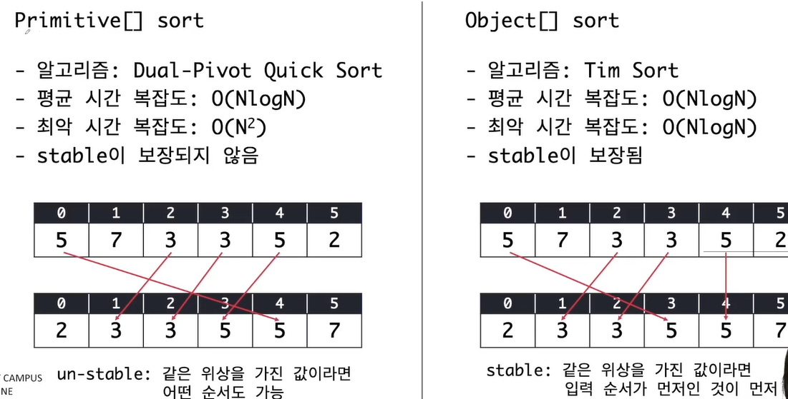
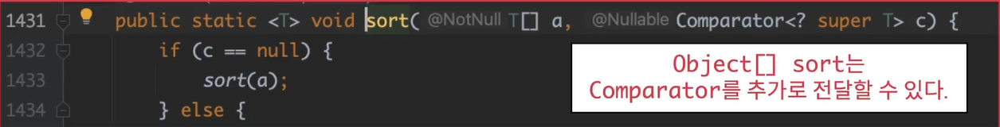
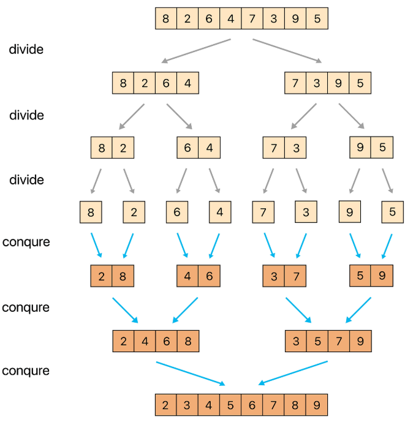
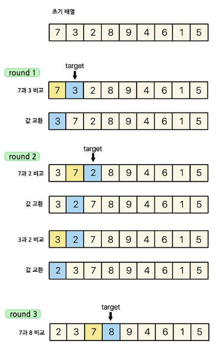
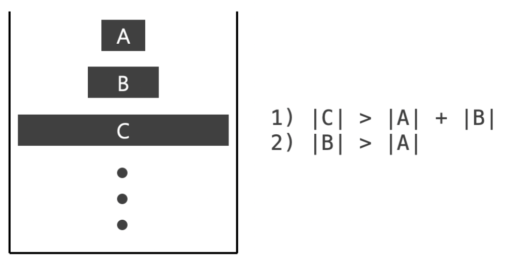
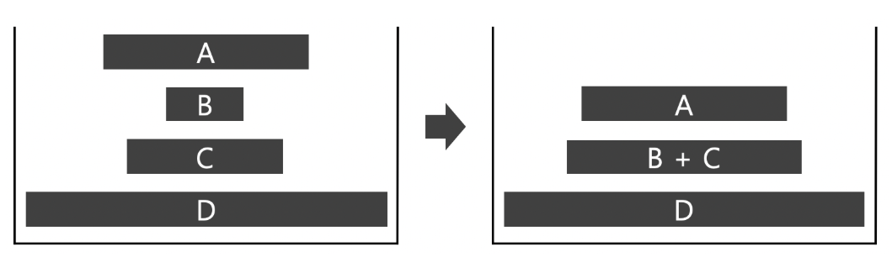
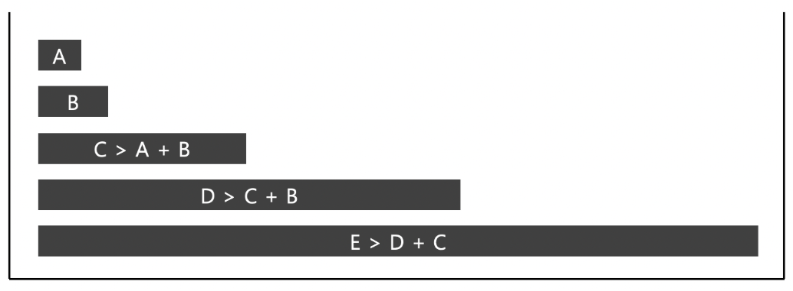
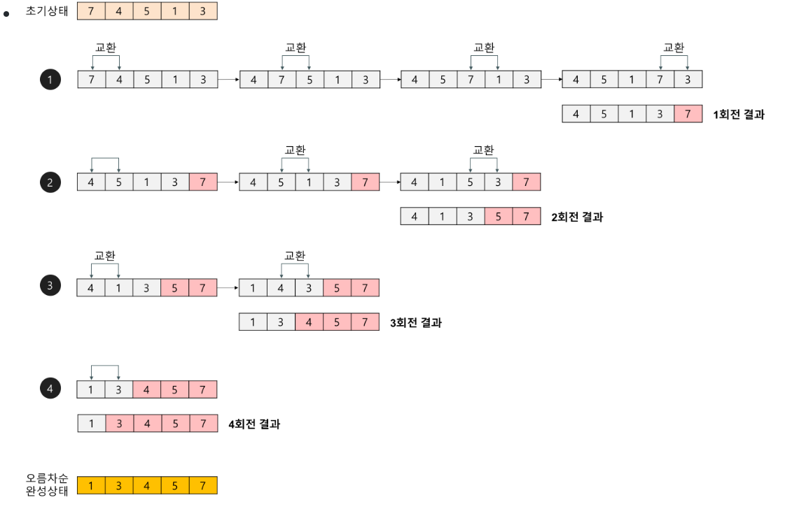

## 정렬
### N^2 정렬 알고리즘
- Bubble Sort
- Selection Sort
- Insertion Sort

### NlogN 정렬 알고리즘
- Quick Sort
- Merge Sort
- Heap Sort

### 그 외
- Counting Sort, Radix Sort, Bucket Sort...

### `Arrays.sort()`
- byte[], short[], int[], long[] 등등 지원 (오름차순)


- Dua-Pivot Quick Sort 
    - Stable 보장 x

- Tim Sort 
    - stable 보장

- (질문) 무조건 Tim Sort가 유리한거아닌가? (최악의 경우 n^2 vs nlogn 보장)
    - Dua-Pivot Quick Sort는 Quick Sort 적용하기에 평균 NlogN보다 빠를 수 있다. 

#### [백준 (2751)](https://www.acmicpc.net/problem/2751)
```java
import java.io.*;
import java.util.*;

class Main{
    public static void main(String[] args) throws IOException {
        BufferedReader br = new BufferedReader(new InputStreamReader(System.in));
        BufferedWriter bw = new BufferedWriter(new OutputStreamWriter(System.out));
        int N = Integer.parseInt(br.readLine());
        // int[] 사용시 시간 초과 
        // int[] arr = new int[N]; 
        Integer[] arr = new Integer[N];
        for(int i=0;i<N;i++){
            arr[i] = Integer.parseInt(br.readLine());
        }
        Arrays.sort(arr); // Primitive 배열 시 Dual-Pivot Quick Sort 사용 : 최악의 경우 N^2, 시간 초과
        for (int i=0;i<N;i++){
            bw.write(arr[i] + "\n");
        }
        bw.flush();
    }
}
```

`int[]` 사용시 시간 초과 왜?? 
- Arrays.sort(arr); // Dual-Pivot Quick Sort : 최악의 경우 N^2, 시간 초과

`Integer[]` 사용해야 한다.
- Tim Sort로 최악의 경우에도 NlogN 보장 


### 내림차순 정렬
#### Primitive 배열 시에는 거꾸로 출력하는 방법 밖에 없다. 
- `for (int i=arr.length-1; i>=0; i--)`
#### Object 배열은 `Collections.reverseOrder()` 지원. 
- `Arrays.sort(arr, Collections.reverseOrder())


---
### 합병정렬 (Merge Sort) - divide and conqure
1. 원소가 하나 될 때까지 분할 한다. 
2. 정렬하면서 합친다. 
    - 나누어 진 것들을 두 개의 포인터 방식으로 정렬 한다. (시간 복잡도 O(N))
    - 정렬이 보장되어져 있는 집합들이니 가능하다. 

시간복잡도 : 분할, 합치는 시간복잡도 (logN) * 정렬시간복잡도(N) = O(NlogN)



---
### 삽입 정렬 (Insertion Sort)
1. 현재 target이 되는 숫자와 이전 위치에 있는 원소들을 비교한다.
    - 첫번째 target은 두 번째 원소부터 시작한다.
2. target이 되는숫자가 이전 위치에 있던원소보다 작다면 위치를 서로 교환한다.
3. 다음 타겟을 찾아 위와 같은 방법으로 반복한다. 


---
### 이진 삽입 정렬(Binary Insertion Sort)

기존 삽입 정렬에서 이분 탐색으로 위치를 찾는 것을 추가해준 알고리즘이다. 코드로 확인해보자
#### 기존 삽입 정렬 코드
```java
void insertionSort(int[] a, int size) {
 
	for(int i = 1; i < size; i++) {
		// 타겟 넘버
		int target = a[i];
 
		int j = i - 1;
 
		// 타겟이 이전 원소보다 크기 전 까지 반복
		while(j >= 0 && target < a[j]) {
			a[j + 1] = a[j];	// 이전 원소를 한 칸씩 뒤로 미룬다.
			j--;
		}
 
		a[j + 1] = target;	
	}
}
```
#### 이진 삽입 정렬 코드

```java
void insertionSort(int[] a, int size) {
 
	for(int i = 1; i < size; i++) {
		// 타겟 넘버
		int target = a[i];
 
		// 0 ~ i 사이 이분탐색을 통해 target이 배치 될 위치를 반환
		int location = binarySearch(a, 0, i, target);
 
		int j = i - 1;
		while(j >= location) {
			a[j + 1] = a[j];	// 이전 원소를 한 칸씩 뒤로 미룬다.
			j--;
		}
 
		a[location] = target;	
	}
}

// 참고사항 : binarySearch 구현할 때 mid = (lo+hi)/2 보단 lo + (hi-lo)/2가 오버헤드 날 확률을 줄인다. 
```
- 이분 탐색으로 삽입 해야할 위치를 찾고, while문 안에서는 한칸씩 뒤로 땡겨줄 (시프팅)뿐이다. 
- 기존 삽입 정렬은 O(N^2), 이진 삽입 정렬 코드도 O(N^2 = N*(logN+N))이다.
    - logN + N = 이분탐색 + 시프팅 

#### 이진 삽입 정렬은 logN의 연산이 더 필요건데 왜 굳이 사용해야하는 것인가?
일반적인 삽입 정렬은 탐색과 시프팅 작업을 동시에 하지만, 이진 삽입 정렬은 탐색을 이분 탐색으로 따로 구하고 시프팅 작업을 한다. 
- `비교 작업 비용` > `시프팅 비용` 일 때 이진 삽입 정렬이 좀 더 빠르다. 
- 일반적인 int[] 배열과 같은 primitive 배열 같은 단순 비교 같은 경우에는 일반 삽입 정렬이 더 빠르겠지만, Object 배열에서 3개 이상의 복합적인 정렬이 필요하다고 생각했을 때에는 비교 작업 비용이 커지기에 이진 삽입 정렬이 유리하다. 


### 팀 정렬(Tim Sort)
- Merger Sort + Insertion Sort(Binary)
- 최선의 시간 복잡도 O(N), 평균 O(NlogN), 최악 O(NlogN)
- 기존 Merge Sort에 비해 적은 추가 메모리를 사용하여 병합 정렬에 단점을 최대한 극복한 알고리즘이다. 
- Insertion sort는 인접한 메모리와 비교를 반복하기에 참조 지역성의 원리를 매우 잘 만족한다. 
    - 그래서 작은 N의 크기에 대해서는 Insertion Sort가 Quick Sort보다 빠르다.
        - Ci x N^2 < Cq x NlogN 성립 (Ci: 삽입 정렬 상수, Cq: 퀵 정렬 상수)
    - *이것을 이용해 전체를 작은 덩어리로 잘라 각각의 덩어리를 Insertion sort로 정렬한 뒤 병합하면 좀 더 빠르지 않을까 하는 것이 기본적인 아이디어이다!!*

#### 용어
- run : n개의 배열을 2^5~2^6크기로 분해한 덩어리
- minrun : min(N,2^5~2^6) 이라는 run 크기를 의미 

#### 방법
Stack + 조건을 통해 피보나치 수열을 만드는 방식을사용한다. 
32 + 32 + 64 + 96 + 160 ....

- 위에 두 식에 해당하지 않은 것이 하나라도 있으면 병합 진행


- 각 run의 길이는 최소 피보나치수보다크므로 n이 1억일 때에도 스택의 크기는 40보다 작게 유지된다. 
- 비슷한 크기의 덩어리와 병합할 수 있다. 최소한의 메모리를이용하여 최고의 효율을 내기 위한 방법이다. 
- merge 시에는 크기가 작은 run을 복사하여 merge 정렬을 수행하면 n/2의 메모리만 사용하여 절약할 수 있다.

#### 참조 지역성 원리
- O(nlogn)이라는 말은 실제 동작시간은 `C × nlogn + α` 의미이다. 
    - 이 C라는 값에 큰 영향을 끼치는 요소로 알고리즘이 '참조 지역성' 원리를 얼마나 잘 만족하는가에 있다. 
- 참조 지역성 원리란, CPU가 미래에 원하는 데이터를 예측하여 속도가 빠른 장치인 캐시 메모리에 담아 놓는데 이때의 예측률을 높이기 위하여 사용하는원리이다. 
    - 최근에 참조한 메모리나 그 메모리와 인접한 메모리를 다시 참조할 확률이 높다는 이론을 기반으로 캐시 메모리에 담아놓는것. 
    - 메모리를 연속으로 읽는 작업은 캐시 메모리에서 읽어오기에 빠른 반면에, 무작위로 읽는 작업은 메인 메모리에서 읽어오기에 속도의 차이가 있다. 
- 참조 지역성이 중요한 이유는 CPU가 메모리에서 직접 데이터를 읽는 것은 매우 느리기 때문에, 한 번 가져올 때 64바이트(캐시라인) 단위로 캐시에 올려두고, 그 안에 있는 데이터를 계속 재사용할수록 캐시 히트가 발생하여 압도적으로 빠르게 접근할 수 있기 때문이다. 즉 "가까운 메모리"를 연속,반복해서 접근하는 패턴이 프로그램 성능에 큰 영향을 준다. 
- Heap Sort
    - 참조 지역성이 좋지 않은 정렬이다. 
    - 트리로 구현되어 있기에 IDX를 이곳 저곳에서 찾아야 한다. (캐시 히트 실패율이 높다.)
    - C가 큰 값으로 정의
- Merge Sort
    - 참조 지역성의 원리를 어느 정도 잘 만족한다. 
    - 입력 매열 크기만큼의 메모리를 추가로 사용한다는 단점이 있다. 
- Quick Sort
    - 퀵 정렬의 경우 pivot 주변에서 데이터의 위치 이동이 빈번하게 발생하기에 참조 지역성이 좋고 메모리를 추가로 사용하지 않는다. 
    - 평균 시간 복잡도는 셋 중에 가장 빠르지마, pivot 선정 방법에 따라 최악의 경우 O(N^2)이 될 수 있음
#### Reference
- https://st-lab.tistory.com/276
- https://d2.naver.com/helloworld/0315536
- https://www.youtube.com/watch?v=HHN1axRRKx8&t=2427s

---
### 퀵 소트(Quick Sort)
1. 분할과정과 정복과정으로 나뉘어짐
2. pivot을 정한 뒤 pivot보다 작은 값은 왼쪽에, 큰 값은 오른쪽에
    - 투포인터(left,right) 사용해서 left에는 pivot보다 큰 것을 찾고 right pivot보다 작은 값을 찾아서 swap하는 방식
3. 왼쪽 퀵소트, 오른쪽 퀵소트
    - 피봇 선정에는 다양한 방식이 있다. 


---
### 버블 정렬
삽입 정렬과 비슷한 메커니즘

1. 첫번째 원소와 두번째 원소 비교해서 큰 놈 뒤로
2. 두번째 원소와 세번째 원소 비교해서 큰 놈 뒤로
3. 계속 반복해서 맨 뒤에 제일 큰 놈 위치

다시 n-1번째까지 위에 반복 n-1번째 제일 큰 놈 위치 이후 그 다음은 n-2번째까지... 쭉 진행




### Branch Predictor란?
cpu가 빠르게 연산하기 위해 미리 예측하여 파이프라인을 짜는 것. 
```
CPU는 빠르게 연산하기 위해 파이프라인 구조를 사용한다. 
명령어 인출 → 해석 → 실행 → 메모리 → 저장
```
- 문제는 다음 명령어가 무엇인지 미리 알아야 파이프라인이 끊기지 않는다. 
- 조건문(if), while문이 등장하면 조건이 참인지 거짓일지, 어떤 방향으로 코드가 흐를지모른다.
- cpu는 다음엔 True로 갈 것 같다. 미리 예측 후 그 명령어를 불러온다. 이것이 BranchPredictor(분기예측기)
- 예측이 잘 맞으면 1~2cycle로 끝나는데 틀리면 전부 되돌리고 반대 방향 명령어를 다시 불러와야 하기에 15~30 cycle이 걸린다. 
