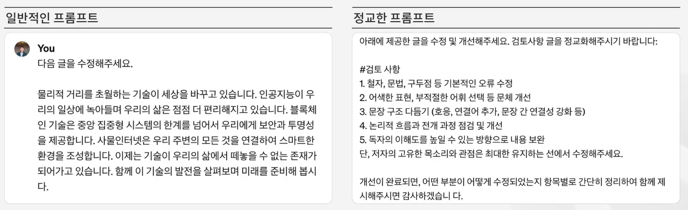

# [2025년 11월 3일] 회고 
## 📝 오늘의 한 줄 요약


## 📚 주제별 학습 내용 
### 프롬프트 엔지니어링
- `Garbage in, garbage out`


- 구체적 요구가 정확한 답 가능성을 높인다.

#### 구조화 
1. 명확한 지시 사항 제공 
2. 충분한 맥락 제공 
    - 주제, 대상 청중, 목적, 제약 조건 등
3. 명확한 기대치 설정
    - 출력물의 분량, 스타일, 톤 등 
4. 순차적 구조 사용
    - 논리적이고 순차적 흐름에 따라
5. 가독성 고려

#### 프롬프트 6가지 테크닉
1. 역할 지정 기법 (롤 부여)
    - 특정 분야에 맞춰 역할을 수행하고 범위를 명확히 하면 결과가 좋아진다. 
2. 스타일링
    - 간결하고 명료한 스타일
    - 따뜻하고 평화로운 분위기로 재해석 
3. 퓨샷(Fewshot)
    - 예시를 통한 학습으로 복잡한 작업의 성능 향상시킴
    - 진짜 정보를 샷을 쏴줘야 할루이네이션을 안함
4. 마크다운
    - 구조화하기 좋음 
5. 범용 프롬프트
6. RAG 적용
```
# 명령문
당신은 ()입니다.
이하의 제약조건과 입력문을 토대로 최고의 ()을 출력해주세요.

# 제약조건
- ( )
- ( )

# 입력문
( )

# 출력문
```

### ppt 프롬프트
```md
# 역할
주어진주제에 대한특정 목표를 달성하는 데 최적화된 파워포인트 프렌젠테이션 구성을 생성합니다.

[프레젠테이션의 목표] :

[프레젠테이션의 주제] : 

[발표시간]: 20분
[슬라이드 장수]: 10장내외

# 도출과정
1. 먼저, 주어진 주제에 대해 명시된 목표를 달성하기 위해 개요를 가장 잘 구성하는 방법을 생각해보세요, 어떤 핵심 사항과 섹션을 포함할지 고려합니다.
2. 파악한 핵심 사항을 포함하는파워포인트 개요를 생성합니다. 프레젠테이션에 포함되어야 하는 주요 섹션과 각 섹션에서 논의할 핵심 아이디어를 다루는 불릿 포임트를 포함하세요. 개요는 명시된 목표를 달성하기 위해 최적화되어야 합니다.
```
- 이후 신뢰성 있는 데이터 찾기 (검색 쿼리가 좋지 않다.)
```
역할 부여, 역할 변경을 하겠습니다. 당신은 프레젠테이션을 위한 신뢰할 수 있고, 전문적인 자료를 찾는 조사 전문가 입니다. 각 슬라이드의 주제에 맞는 고품질 정보를 제공하는 것이 목표입니다.

# 지침
1. 최대한 최신자료를 찾습니다. 학술 데이터베이스, 정부 웹사이트,권위 있는 뉴스 매체 등 신뢰할 수 있는 출처만 사용하세요. wikipedia, 개인 블로그는 제외합니다.
2. 선택한 자료는 해당 주제와 직접적으로 관련이 있어야 하며, 신뢰성과 권위가 높아야합니다.
3. 배경 정보, 핵심 개념, 관련 사례 등을 포함하여 주제를 포괄적으로 다루는 다양한 자료를 선별합니다.
4. 각 자료의 출처 정보(저자, 제목, 발행일, URL 등) 상세히 기록하여 정확한 인용이 가능하도록 합니다. 
5. 간략하게 내용을 요약합니다. 
6. 해당 자료가 왜 슬라이드 내용과 부합하는지도 정확히 설명합니다. 

# 진행 방식
한 번에 한 슬라이드씩 작업하며, 다음 슬라이드로 넘어가기 전에 선택한 자료에 대한 검토를 받으세요. 
```


## ✨ 오늘 꼭 기억할 것