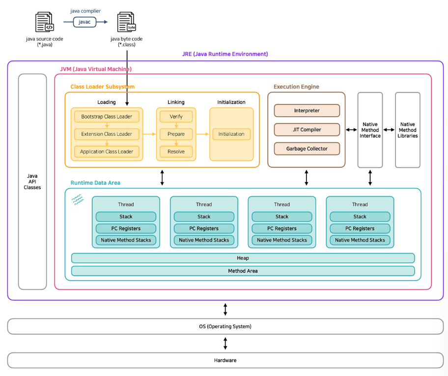
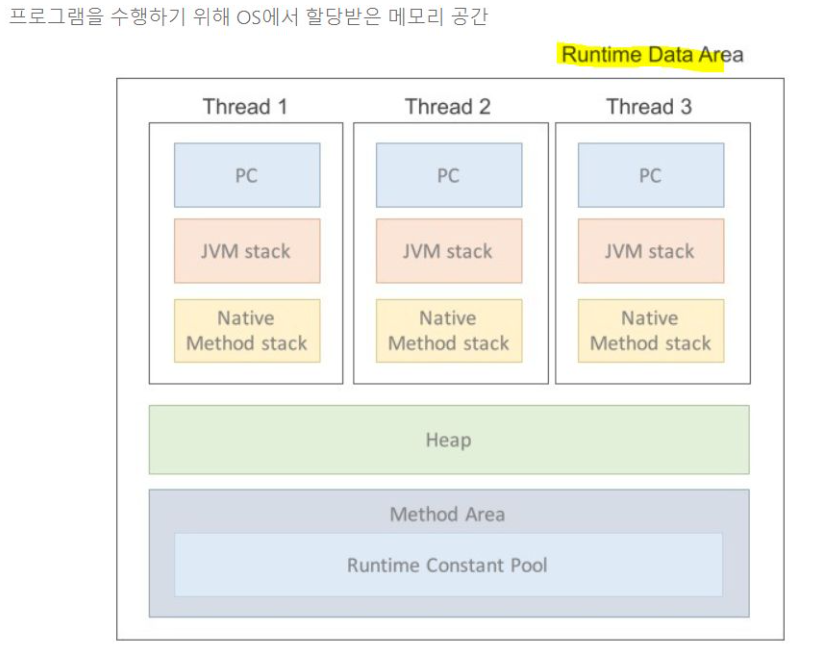

### JDK, JRE, JVM 차이
- JVM : 실행 환경 (Java Virtual Machine)
- JRE : JVM + 기본 라이브러리 (Java Runtime Environment)
- JDK : JRE + 개발 툴(컴파일러 등)
> JVM은 자바 프로그램을 실행하는 가상 환경이고, JRE는 JVM과 표준 라이브러리를 포함한 실행 환경입니다. JDK는 JRE에 컴파일러나 디버거 같은 개발 도구를 포함해 자바 개발이 가능하도록 한 패키지입니다. 
### 언어의 지향방향
- 절차 지향 : 절차적으로 실행되는 `순서`가 중요하며 반복되는 코드들은 함수로 만들어 사용한다. 
- 객체 지향 : 객체들 간의 `협력`을 지향하며 객체 간의 연관관계를 구현한다. 
- 함수 지향 : 객체끼리 얽혀 있는 OOP와 달리 독립적인 함수들을 사용해서 서로 간의 사이드이펙트가 발생하지 않는다. 
    - 자바에서 람다식 문법이 있다.
 

## 객체 지향 프로그래밍
### 상속 (Inheritance)
> 부모 클래스의 특성을 자식 클래스가 물려받는 매커니즘이다.
- 객체들 간에 공통된 개념을 추상화하여 상위 개념과 하위 개념의 일반화를 표현하기 위해 사용된다. 
- 객체 간의 관계를 표현하기 위해 사용
- 일반적인 것이 좀 더 구체적으로 되는 것이 상속
    - customer -> vip customer
- 코드의 재사용성을 높이고 객체의 계층 구조를 나타낸다.

### 다형성 (polymorphism) 
> 한 객체가 여러 형태를 가질 수 있음을 의미한다. 
- 자바에서 하나의 타입이 여러 형태로 동작할 수 있는 성질을 의미한다. 
    - 예를 들어 `Person p = new vipPerson()` / `Person p = new normalPerson` 과 같이 Person 타입으로 vipPerson이나 normalPerson 여러 형태로 동작하며 각 인스턴스에 맞는 메서드가 호출된다. 
- keyword : 오버라이딩, 업캐스팅
    - (참고) 오버라이딩과 오버로딩의 차이점 : 오버라이딩은 자식 클래스가 부모 클래스의 메서드를 재정의하는 것이다.오버로딩은 같은 메서드의 이름을 사용하더라도 매개변수의 개수와 타입이 다르게 사용할 수 있게 하는 것이다. 
    - 업캐스팅 : 상속 관계에서 자식 객체를 부모 타입으로 참조하는 것, 이를 통해 서로 다른 자식 객체들을 동일한 부모 타입으로 다룰 수 있게 된다. 

### 상속 + 업캐스팅 + 오버라이딩 + 가상메서드 + 다형성 
- 상속 : 부모 클래스의 특성을 자식 클래스가 물려받는 매커니즘
- 업캐스팅 : 상속 관계에서 자식 객체를 부모 타입으로 참조하는 것
- 오버라이딩 : 자식 클래스가 부모 클래스의 메서드를 재정의하는 것
- 가상메서드 : 런타임에 실제 객체의 타입에 따라 호출될 메서드가 결정되는 메커니즘
- 다형성 : 한 객체가 여러 형태를 가질 수 있는 것. 
> 상속으로 공통 인터페이스를 정의하고, 오버라이딩으로 각 클래스의 특성을 구현하며, 업캐스팅과 가상메서드를 통해 런타임에 적절한 동작이 선택되어 다형성이 실현됩니다. 이로 인해 개방-폐쇄 원칙을 따를 수 있습니다. 

### 추상 클래스와 인터페이스 차이 

## JVM
Class Loader -> Runtime Data Area -> Execution Engine -> GC 
### JAVA 동작과정
1. 자바 컴파일러가 소스코드를 바이트 코드로 변환 시킨다.
2. 클래스로더가 바이트코드를 JVM의 Runtime Data Area로 올린다.
3. Execution engine의 인터프리터와 JIT 컴파일러를 통해 코드를 해석한다. 

### JVM 메모리 영역 Runtime Data Area

- PC Registers
    - 현재 실행 중인 명령어의 위치를 가리킴
- Stack 
    - 각 스레드에서 코드를 실행하는데 사용하는 메모리 영역
    - 메소드가 수행될 때마다 하나의 스택 생성(push)되고, 메소드가 종료되면 스택 pop
- Native Method Stack
    - Native method를 호출하는 코드를 수행하기 위한 스택 영역
- Heap
    - new 키워드를 통해 생성된 객체를 위한 공간
    - gc가 알아서 제거
- Method Area 
    - static키워드가 붙은 데이터를 위한 공간

### Execution Engine
클래스 로더에 의해 runtime data area에 배치된 바이트 코드의 명령어를 읽어서 실행한다. 
- Interpretier
    - 명령어를 하나씩 읽어서 해석하고 실행
- JIT Compiler
    - JIT : Just In Time Compiler
    - 전체를 컴파일 하지 않고, 인터프리터가 자주 사용하는 메소드의 바이트 코드를 컴파일하여 바이너리 코드로 변환
    - 후에 해당 메소드를 사용할 때는 인터프리터 사용 x, 저장된 바이너리 코드 사용
- GC
    - heap을 대상으로 필요없는 객체들을 제거하여 메모리 공간을 compact하게 만든다. 
        - 객체가 null인 경우
        - 블럭의 local 객체 
        - 부모 객체가 null인 자식 객체 

### GC(Garbage Collector)
> 자바의 메모리 관리방법 중의 하나로 JVM의 Heap 영역에서 동적으로 할당했던 메모리 중 필요 없게 된 메모리 객체를 모아 주기적으로 제거하는 프로세스

